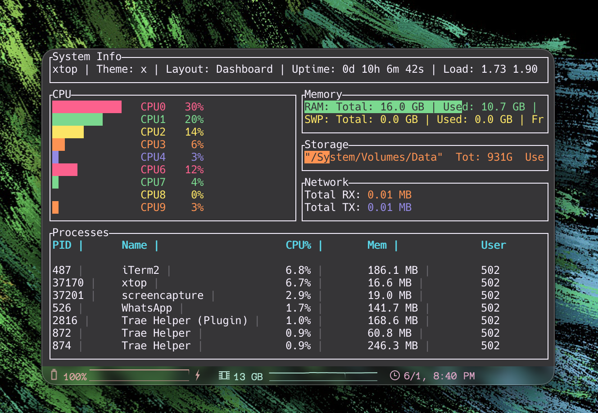
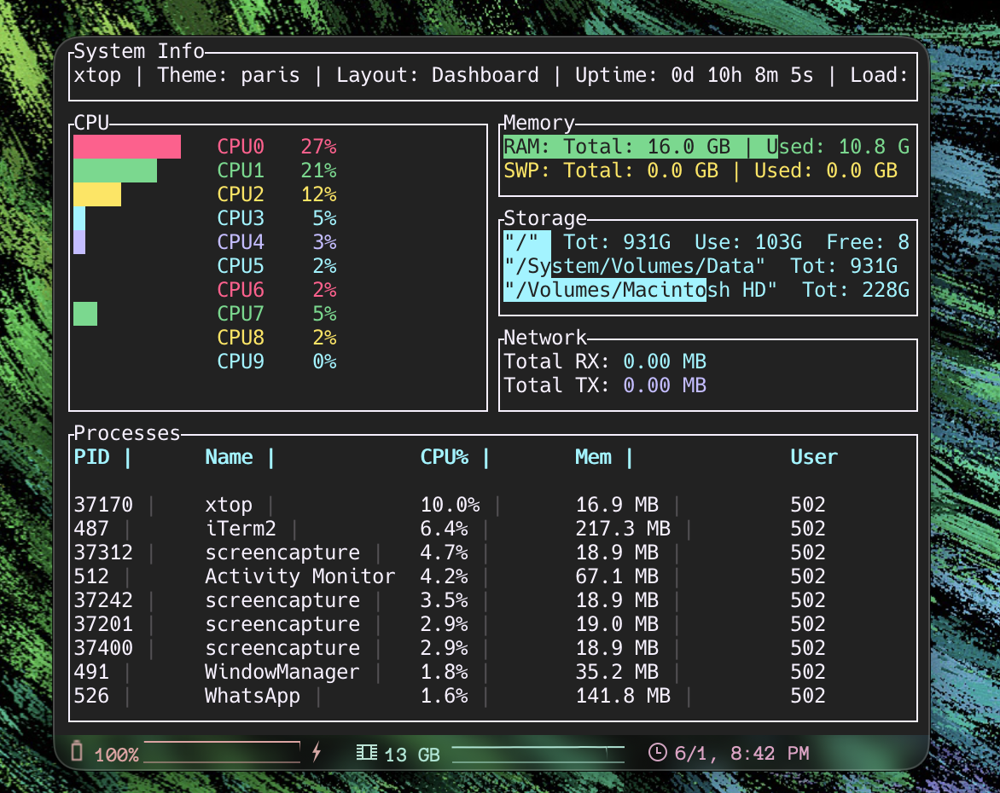
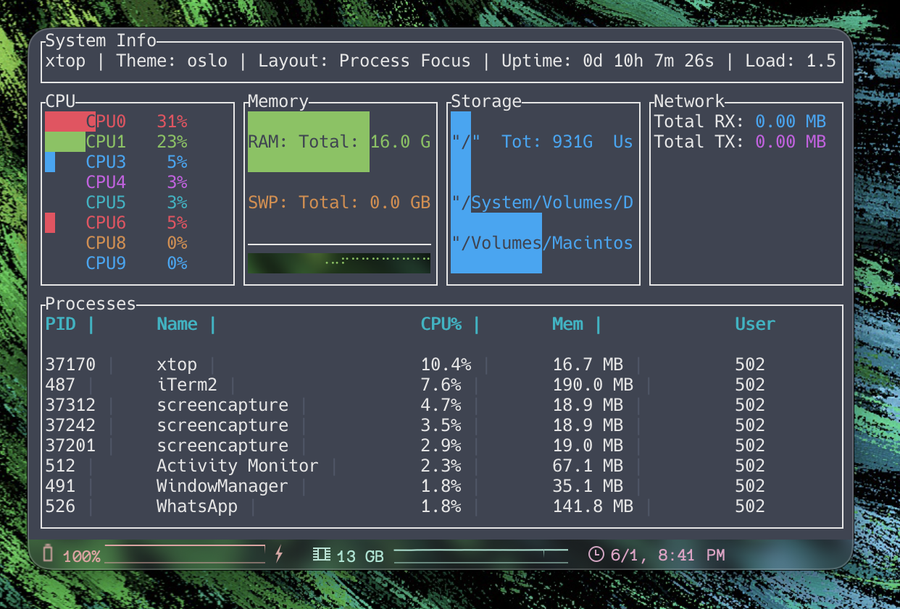
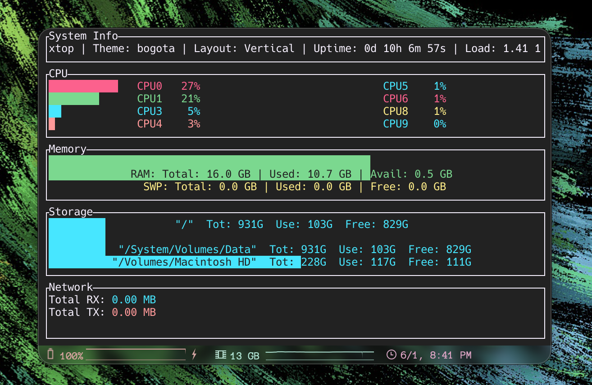

<h1 align="center"> Xtop </h1>

<div align="center">

    

xtop is a modern, cross-platform TUI system monitor crafted in Rust. Heavily inspired by btop, it leverages Rust's safety and performance, powered by ratatui for the interface and sysinfo for real-time metrics.

</div>

<p align="center"></p>

---

# Previews

<p align="center">
  <a href="./assets/previews/preview1.png">
    
  </a>
</p>

<details>
  <summary>More previews</summary>

  <table>
    <tr>
      <td align="center">
        <a href="./assets/previews/preview2.png">
          
        </a>
      </td>
      <td align="center">
        <a href="./assets/previews/preview3.png">
          
        </a>
      </td>
    </tr>
    <tr>
      <td align="center">
        <a href="./assets/previews/preview4.png">
          
        </a>
      </td>
      <td align="center">
      </td>
    </tr>
  </table>
</details>

## Features

- **Cross-Platform:** Runs on macOS, Linux, and Windows.
- **System Monitoring:**
  - **CPU:** Usage per core/thread, maximum temperature sensing.
  - **Memory:** RAM and Swap usage with historical graphing.
  - **Network:** Real-time upload and download tracking.
  - **Disks:** Storage usage visualization.
  - **Processes:** List of running processes sorted by CPU usage.
- **Theming:**
  - Includes 13 built-in color schemes (e.g., Dracula-like 'x', Madrid, Tokio, etc.).
  - Cycle through themes instantly without configuration files.
- **Layouts:**
  - **Dashboard:** Balanced view of all components (Default).
  - **Vertical:** Stacked view, good for narrow terminals.
  - **Process Focus:** Maximizes space for the process list while keeping essential stats visible.

## Installation

### Quick Install (macOS/Linux)

The installer script automatically detects your distribution and installs all required dependencies (including Rust if needed).

**Install with curl:**
```bash
curl -fsSL https://raw.githubusercontent.com/xscriptordev/xtop/main/install.sh | bash
```

**Or with wget:**
```bash
wget -qO- https://raw.githubusercontent.com/xscriptordev/xtop/main/install.sh | bash
```

**Uninstall:**
```bash
curl -fsSL https://raw.githubusercontent.com/xscriptordev/xtop/main/install.sh | bash -s -- --uninstall
```

<details>
<summary>Installer Options</summary>

You can also run the installer with additional options:

```bash
# Check dependencies without installing
./install.sh --check-deps

# Install only dependencies (Rust, build tools)
./install.sh --install-deps

# Show help
./install.sh --help
```

**Supported distributions:** Arch, Debian/Ubuntu, Fedora/RHEL, openSUSE, Alpine, and derivatives.

</details>

### Quick Install (Windows PowerShell)

Requires [Rust (Cargo)](https://rustup.rs/) installed. Run in PowerShell:

**Install:**
```powershell
irm https://raw.githubusercontent.com/xscriptordev/xtop/main/install.ps1 | iex
```

**Uninstall:**
```powershell
irm https://raw.githubusercontent.com/xscriptordev/xtop/main/uninstall.ps1 | iex
```

### Build from Source

1. Clone the repository:
   ```bash
   git clone https://github.com/xscriptordev/xtop.git
   cd xtop
   ```

2. Build and run:
   ```bash
   cargo run --release
   ```

## Usage

### Keybindings

| Key | Action |
| --- | --- |
| `q` | Quit application |
| `t` | Next Color Theme |
| `T` | Previous Color Theme |
| `l` | Toggle Layout Mode (Dashboard -> Vertical -> Process Focus) |

### Modules

1. **Header**: Shows system uptime, load average, current theme, and layout mode.
2. **CPU**: Shows usage bars for each CPU core. If sensors are available, shows the maximum CPU temperature.
3. **Memory**: Gauges for RAM and Swap usage, plus a line chart for RAM history.
4. **Network**: Total downloaded (RX) and uploaded (TX) data.
5. **Processes**: A scrolling list of the top 50 processes sorted by CPU usage.

## Configuration

Currently, `xtop` is zero-config. All preferences (theme, layout) can be toggled at runtime but are reset on restart. Future versions may include a config file.

## License
[MIT](LICENSE)
